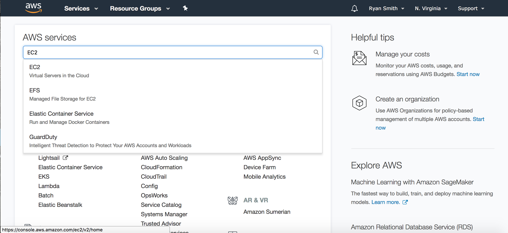
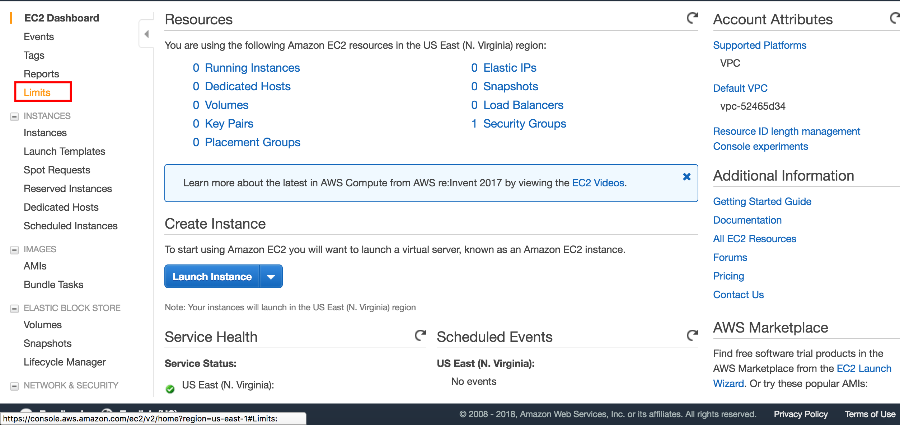
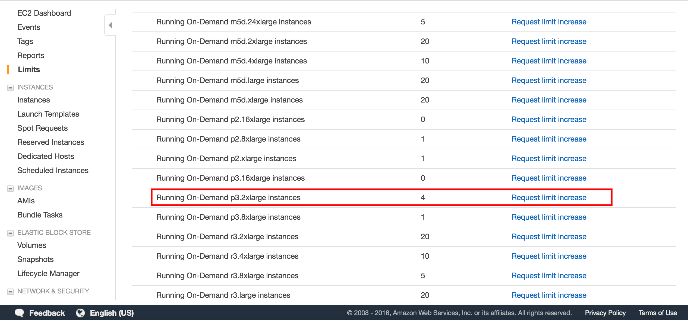

# Codesmith Deep Learning

Welcome to Codesmith Deep Learning! In this course, we will develop the experience and expertise required to train, deploy, and analyze deep learning models.

Whether you are a software engineer who wants to know how you can start implementing machine learning models in your current job, a data scientist who wants to add neural networks to their tool belt, or an intermediate/advanced python coder who wants to see what deep learning is all about, this course has something to offer anyone that is interested in neural networks and the future of machine learning.

If you haven't already, please join our slack team - you should have an email from slack inviting you to join the team. We'll use slack throughout the course to share helpful resources and learning materials, ask and answer stack overlow-style questions when people are stuck on coding challenges, and communicate about all things related to this course.

# What to expect from the course

We value building an inclusive and supportive community. Above all, you should expect to cultivate empathetic technical and non-technical communication with your peers. After all, engineering doesn't happen in isolation - it happens in teams. If you are kind and thoughtful in your communication, you should expect to build a network of bright and ambitious peers that will help further your career in machine learning.

In addition to community building, the Codesmith team is dedicated to developing ambitious and groundbreaking curriculum and pedagogy. We seek to challenge our program participants to think deeply and engage critically with code they write and with the code their peers write. While we can provide a path for our students to follow, ultimately it's up to each of you to provide the engine that powers you down that path. Put simply, what you put in is what you will get out.

A professor in a research seminar once told me, "the student that learns and creates the most in this seminar will neglect their other studies, they will be singly focused on the research at hand." I was not the student that learned the most in that seminar - I understand that our program participants have jobs and families and many other responsibilities. Part of the reason we've chosen to offer this as an online course is due to the flexibility this affords our participants. But if you are willing and able to put in extra time coding and studying the material covered in instructional hours, you will come away with a fuller understanding of the power and applications of machine learning.

Lastly, you will learn that no code is sacred. Throughout the course, we provide you with some boilerplate code and, occasionally, test cases to guide towards thoughtful, concise solutions to the problems you are expected to solve. Don't take this code for granted. Read it, study it, understand it, and alter it if it doesn't lead you towards the approach that seems most natural to you.

# CSDL Precourse

In order to hit the ground running on the first day of class, you've got to be prepared to write clear, concise python code. Priority number one for this pre-course is to lay the strong foundation of python skills that will enable you to succeed in the rest of the course. Along the way you will be exposed to important foundational concepts of machine learning.

Throughout CSDL, we'll rely heavily on a number of tools including a machine learning framework called *TensorFlow* and a scientific computing platform called *Jupyter*. Jupyter is a wonderful scientfic and educational tool with too many incredible features to list. Priority number two for the pre-course is to set up your environment with the proper tools and to get you off the ground with Jupyter. Jupyter is heavily used in industry, and will allow you to create expressive notebooks and presentations that document the machine learning work you've done.

Priority number three is to refresh yourself on a few foundational topics in mathematics. You'll find more information on this below!

As you work on the pre-course, you can expect to:

* be challenged to write clear and creative code
* use resources like google, stack overflow, and official python and numpy documentation to answer your questions
* use the #help-desk channel in the CSDL slack if you are stuck on a problem for more than a half hour (see the *Using #help-desk in slack* section below)
* keep an optimistic attitude as you overcome difficult technical challenges
* have questions about parts of the pre-course that are particularly difficult or confusing for you (we will discuss on day one of the course)
* learn to comfortably navigate jupyter notebooks
* see new ways to use python's object oriented features
* use python's magic methods to build sophisticated custom classes
* build a working machine learning model that is heavily used in industry from scratch

# Setting up your environment

We'll be using Git, Github, Anaconda3, and TensorFlow throughout this course. Git and Github are version control and code-sharing tools widely used by a variety of software engineers, data scientists, and people in technical roles. Anaconda3 provides users with a scientific computing environment suitable for a variety of machine learning tasks. TensorFlow is a machine learning framework that gives engineers fine-grained control over the models they design and train.

*If you have difficulty with any of the following steps, please let us know in the #help-desk channel on slack!*

## Git and Github
To begin, you will need a Github account and you will need to install git on your computer. If you haven't done either of these things, please do so now.

* Create a Github account [here](https://github.com)
* Git installation instructions [here](https://git-scm.com/book/en/v2/Getting-Started-Installing-Git)

After completing the steps above, create your own fork of this repo. To do this, visit this repo on the Codesmith organization on Github. Hit the fork button in the upper right hand corner, and then select your github account. You should be redirected to the new fork you've created.

Now you should clone the fork you've created. hit the green "Clone or download" button and copy the download url that appears. Open up a new terminal window on your computer and navigate to the directory you'd like to store the course materials in. Run the following commands:

1. `git clone <download url you copied>`
1. `cd CSDL-<cohort number>`
1. `git remote add upstream https://github.com/CodesmithLLC/CSDL-<cohort number>.git`

Now you're ready to get started with the precourse! Navigate to the `precourse` directory and see the README for directions.

## Anaconda3 - Installation Guide

Visit the anaconda installation site [here](https://www.anaconda.com/download).

Download the Anaconda (please download the Python 3.6 version with the Command-Line Installer).

Once you've downloaded the installer, follow the instructions located [here](https://docs.anaconda.com/anaconda/install).

To verify the necessary tools have been setup, open up a terminal and run the comman `jupyter --version`. This should print something like `4.4.0`. If this command doesn't work, make sure you have followed the instructions in the intallation guide that show you how to update your `PATH` environment variable.

## TensorFlow - Installation Guide

Once you have installed Anaconda, visit the TensorFlow installation site [here](https://www.tensorflow.org/install/). Choose your operating system, and follow instructions to install TensorFlow (with CPU support only) with Anaconda.

When you are finished, you should follow the instructions in the "Validate your installation" section to make sure TensorFlow has been properly installed.

## AWS - Limit Increase Request

Eventually we will be training deep models on large data sets. To do this efficiently we need access to computers with GPUs that specialize in performing repetitive computational tasks like matrix multiplication in parallel. Amazon Web Services (AWS) is a cloud hosting platform that will allow us to launch virtual servers with GPU access.

If you don't have an AWS account, visit [this site](https://aws.amazon.com/) to make one now.

Not all AWS accounts have the proper permissions to launch servers with GPU access. Depending on your current and past AWS use, you may or may not have access to the proper computational resources. Let's walk through the steps to ensure you have access to the proper AWS resources. The permissions process may take a few days, so it's important that you do this now so that you're ready to start using your AWS instance when we are ready to train larger models.

From the main AWS dashboard, search for EC2 (Elastic Cloud Compute). EC2 is the service that we will use to launch virtual servers on AWS's cloud infrastructure.

Once you select the EC2 service, you will be taken to the main EC2 dashboard. On the far left of your screen there should be a menu. From this menu, select the "Limits" tab.

Now you should see a screen listing the different types of available EC2 instance types. For this course, we will be using p3.2xlarge instances, since they have access to appropriate computational resources. Scroll down till you see the p3.2xlarge instance type. If your limit is 1 or higher, you are all set. Otherwise, select the "Request limit increase" option.

A new page will open. You must select the region you'd like to launch your server in (I'd recommend picking whichever region is geographically nearest to you). Select the "p3.2xlarge" instance type, and the "new limit value" 1. In the "Use Case" field, explain that you will be training convolutional networks for image processing tasks. When you've filled out this field, submit your request. You should receive an email from AWS and your request should be reviewed and approved within a few days.

# Precourse instructions

1. If you haven't already, please fork and clone this repo. Instructions for this can be found in the README in the home directory of this repository.
1. In your terminal, navigate to the repo you've just cloned, and then navigate to the `precourse` directory.
1. Run the command `jupyter notebook`. A web browser window will popup displaying the files in this directory.
1. Click on the `jupyternotebooks.ipynb` file to get started.
1. When you are done with `jupyternotebooks.ipynb`, move on to `knn.ipynb`.
1. We will be diving straight into neural networks on day one. In order to do so, there are some mathematical topics that will be useful to have familiarity with. In particular, you should be able to answer the following questions at a high level. You don't need to answer these with rich technical detail, but having a basic understanding of each of these concepts will be very useful. I highly recommend using [Khan Academy](https://www.khanacademy.org/math/linear-algebra) or similar resources to refresh yourself on these topics if necessary. Here are the questions:
    * What is a vector?
    * What is a vector space?
    * How do you compute the dot product of two vectors and what is the meaning of dot product?
    * What is a matrix?
    * How do you perform matrix multiplication and what is an example of a practical application of matrix multiplication?
    * What is a partial derivative?
    * What is the gradient of a function?
    

## Using #help-desk in slack

The more information you provide us with about the problems you are facing, the easier it will be for your peers and myself to offer you advice and guidance. I highly recommend using [stackoverflow's guide for asking questions](https://stackoverflow.com/help/how-to-ask).

If you haven't provided a detailed account of the problem you are facing, you may be asked to rephrase or rewrite your question.

*Good luck completing the pre-course - we look forward to seeing you on day one of class!*
